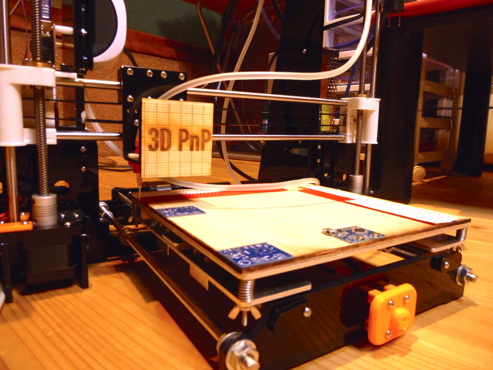

3D PnP
======

This software eats Eagle partlist file and spits GCode.  
Hack your old 3D printer into an Pick and Place machine real easy.

Eagle Partlist -> Configure w/ 3D PnP software -> GCode -> Hacked 3D Printer

Special thanks to [Gaudi Labs](http://www.gaudi.ch/GaudiLabs/?page_id=213) for inspiration 

Modifying the Printer
---------------------

+ Remove everything heat-related from your printer
  + hotend, thermostats, fans, heatbed-cables, etc
+ Hack a fishtank bubbler so that it sucks the air in
+ Get a solder paste dispenser needle and fix it to the carriage of your printer
+ Connect the needle and the fishtank bubbler with a soft tube
+ Install a 12V relay in the power line of the fishtank bubbler
+ Connect the relay's coil and the fan output of your RAMPS board
+ If it won't work, get Sprinter firmware and upload it to your RAMPS

[This blog post](http://mechanic.pilotz.jp/2017/07/diy-pnp-progress-report/) shows a few pictures

Running the software
---------------------

+ Get Dr. Racket
+ Run src/pnp-manager.rkt
+ Import a partlist file you made using Eagle
+ Set your settings
+ Hit Generate GCode -> Save to file
+ Open Repetier Host or something alike
+ Hit Run

Lisence
-------

GPL

Warning
-------

I haven't tested this with anything other than my own partlist wich is files/sticky-watch-1.5-partlist.txt and thus it is highly unlikely that it works perfect for your board on the first try.  You gotta make your own changes please.

I unfortunately won't have much time to work on this right now.  Feel free to go anywhere on your own from here.  I'd love PRs.

Thanks

[Minori Yamashita](https://ympbyc.github.io/)
